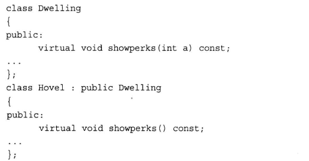

### C++内存分布


 **32**bitCPU**可寻址4G线性空间**，**每个进程**都有各自独立的4G逻辑地址，其中0~3G是用户态空间，3~4G是内核空间，不同进程相同的逻辑地址会映射到不同的物理地址中。其逻辑地址其划分如下：

各个段说明如下：

3G用户空间和1G内核空间

静态区域：

text segment(代码段):包括只读存储区和文本区，其中只读存储区存储字符串常量，文本区存储程序的机器代码。

data segment(数据段)：存储程序中已初始化的全局变量和静态变量

bss segment：存储未初始化的全局变量和静态变量（局部+全局），以及所有被初始化为0的全局变量和静态变量，对于未初始化的全局变量和静态变量，程序运行main之前时会统一清零。即未初始化的全局变量编译器会初始化为0

动态区域：

heap（堆）：  当进程未调用malloc时是没有堆段的，只有调用malloc时采用分配一个堆，并且在程序运行过程中可以动态增加堆大小(移动break指针)，从低地址向高地址增长。分配小内存时使用该区域。  堆的起始地址由mm_struct 结构体中的start_brk标识，结束地址由brk标识。

memory mapping segment(映射区):存储动态链接库等文件映射、申请大内存（malloc时调用mmap函数）

stack（栈）：使用栈空间存储函数的返回地址、参数、局部变量、返回值，从高地址向低地址增长。在创建进程时会有一个最大栈大小，Linux可以通过ulimit命令指定

---


栈区（stack）： 由编译器自动分配释放 ，存放函数的参数值，局部变量的值等。 

堆区（heap） ： 一般由程序员分配释放， 若程序员不释放，在程序结束时，操作系统回收。

全局区（静态区static）：存放全局变量、静态数据、常量。程序结束后由系统释放。全局区分为已初始化全局区（data）和未初始化全局区（bss）。划分的主要原因是节省了**磁盘空间**

```
对于单个变量可能不明显，但当情形是初始化和未初始化的大型数组时，例如
int ar0[10000] = {1, 2, 3, ...};
和 
int ar1[10000];
时，
把ar1放在bss段，只记录共有10000*4个字节要初始化为0，而不是像ar0那样记录每一个数据1，2，3...，那么bss为目标文件所节省的磁盘空间还是相当可观的！
```

**文字（只读）常量区** ：常量字符串就是放在这里的。 程序结束后由系统释放 

**代码段**：存放函数体的二进制代码

### 静态全局变量和全局变量的区别

静态全局区只在本文件中有效，别的文件想调用该变量，是调不了的，而全局变量在别的文件中可以调用 

### new和malloc的区别

#### 申请内存所在的位置

new操作符从**自由存储区（free store）**上为对象动态分配内存空间，而malloc函数从**堆**上动态分配内存。自由存储区是C++基于new操作符的一个抽象概念，凡是通过new操作符进行内存申请，该内存即为自由存储区。而堆是操作系统中的术语，是操作系统所维护的一块特殊内存，用于程序的内存动态分配，C语言使用malloc从堆上分配内存，使用free释放已分配的对应内存。

那么自由存储区是否能够是堆（问题等价于new是否能在堆上动态分配内存），这取决于operator new 的实现细节。自由存储区不仅可以是堆，还可以是静态存储区，这都看operator new在哪里为对象分配内存。

#### 返回类型安全性

new操作符内存分配成功时，返回的是对象类型的指针，类型严格与对象匹配，无须进行类型转换，故new是符合**类型安全**性的操作符。而malloc内存分配成功则是返回void * ，需要通过强制类型转换将void*指针转换成我们需要的类型。
 类型安全很大程度上可以等价于内存安全，类型安全的代码不会试图方法自己没被授权的内存区域。关于C++的类型安全性可说的又有很多了。

#### 内存分配失败时的返回值

new内存分配失败时，会抛出bac_alloc异常，它**不会返回NULL**；malloc分配内存失败时返回NULL。
 在使用C语言时，我们习惯在malloc分配内存后判断分配是否成功；但在C++中没有必要，应该改用异常处理

#### 是否需要指定内存大小

使用new操作符申请内存分配时无须指定内存块的大小，编译器会根据类型信息自行计算，而malloc则需要显式地指出所需内存的尺寸。

#### 是否调用构造函数/析构函数

使用new操作符来分配对象内存时会经历三个步骤：

- 第一步：调用operator new 函数（对于数组是operator new[]）分配一块足够大的，**原始**的，未命名的内存空间以便存储特定类型的对象。
- 第二步：编译器运行相应的**构造函数**以构造对象，并为其传入初值。
- 第三部：对象构造完成后，返回一个指向该对象的指针。

使用delete操作符来释放对象内存时会经历两个步骤：

- 第一步：调用对象的析构函数。
- 第二步：编译器调用operator delete(或operator delete[])函数释放内存空间。

总之来说，new/delete会调用对象的构造函数/析构函数以完成对象的构造/析构。而malloc则不会。

#### 对数组的处理

C++提供了new[]与delete[]来专门处理数组类型:

#### 相互调用

operator new /operator delete的实现可以基于malloc，而malloc的实现不可以去调用new

#### 是否可以被重载

opeartor new /operator delete可以被重载。标准库是定义了operator new函数和operator delete函数的8个重载版本

#### 能够直观地重新分配内存

使用malloc分配的内存后，如果在使用过程中发现内存不足，可以使用realloc函数进行内存重新分配实现内存的扩充。realloc先判断当前的指针所指内存是否有足够的连续空间，如果有，原地扩大可分配的内存地址，并且返回原来的地址指针；如果空间不够，先按照新指定的大小分配空间，将原有数据从头到尾拷贝到新分配的内存区域，而后释放原来的内存区域。

new没有这样直观的配套设施来扩充内存

### 虚函数的一些注意事项

1. 在基类方法的声明中使用`virtual`可以使得该方法在基类以及所有的派生类（**包括从派生类派生出来的那些类**）中都是虚的
2. 如果使用指向对象的引用或指针来调用虚方法，程序将使用为对象类型定义的方法，而不使用为引用或指针类型定义的方法，这称之为**动态联编**，这样基类的指针和引用就可以指向派生类对象
3. 基类应该将那些要在派生类中重新定义的类方法声明为虚的
4. 注意，单纯的派生类函数覆盖，会形成**静态联编**

#### 构造函数和析构函数可否为虚函数

构造函数不能声明为虚函数，析构函数一般声明为虚函数，除非该类不用作基类。

我们有时候会通过基类的指针来销毁对象，如果析构函数不为虚的话，就不能正确识别对象类型，从而不能正确销毁对象。

```cpp
A *p = new B; delete p;
```

如果类A的析构函数是虚函数，delete p; 将会先调用B的析构函数，**再调用**A的析构函数，释放B对象的所有空间。

基类应该提供显式的虚析构函数

```cpp
virtual ~BaseClass(){}
```

虚函数的调用需要虚函数表指针，而该指针存放在对象的内容空间中；若构造函数声明为虚函数，那么由于对象还未创建，还没有内存空间，更没有虚函数表地址用来调用虚函数——构造函数了。

#### 重新定义将隐藏方法



如果重新定义，不会生成函数的两个重载版本，而是隐藏了同名的基类虚函数；也就是并不是重载，而是隐藏，不管参数特征如何

#### 构造函数/析构调用虚函数的后果

一般情况下，不允许在构造函数或者析构函数中调用虚函数。其实语法上都没有问题，只是会失去多态性。

 如果在构造函数中调用虚函数，会先调用父类中的实现，也就失去了多态的性质

```cpp
class A {
    public:
    virtual void print() {
        cout << "A" << endl;
    }
    A() {
        print();
    }
    ~A() {
        //print();
    }
};
class B :public A {
    void print() {
        cout << "B" << endl;
    }
};
int main() {
    A* ptr = new B;
    return 0;
}
```

输出的结果是A

### 解释一下右值引用，和左值有什么区别

右值引用是C++11中引入的新特性,它实现了转移语义和精确传递。它的主要目的有两个方面：   

1. 消除两个对象交互时不必要的对象拷贝，节省运算存储资源，提高效率。 
2. 能够更简洁明确地定义泛型函数。    

  左值和右值的概念：    左值：**能对表达式取地址**、或具名对象/变量。**一般指表达式结束后依然存在的持久对象**。     右值：**不能对表达式取地址**，或匿名对象。一般指表达式结束就不再存在的临时对象。    右值引用和左值引用的区别：  

1. 左值可以寻址，而右值不可以。    
2. 左值可以被赋值，右值不可以被赋值，可以用来给左值赋值。    
3. 左值可变,右值不可变（**只对基础类型适用**，用户自定义类型右值引用可以通过成员函数改变）。